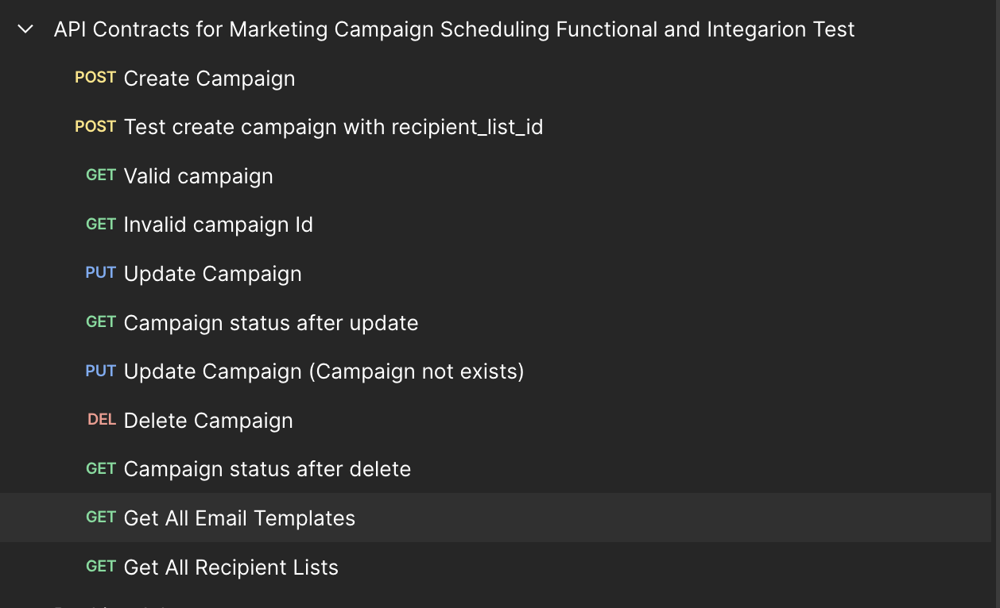
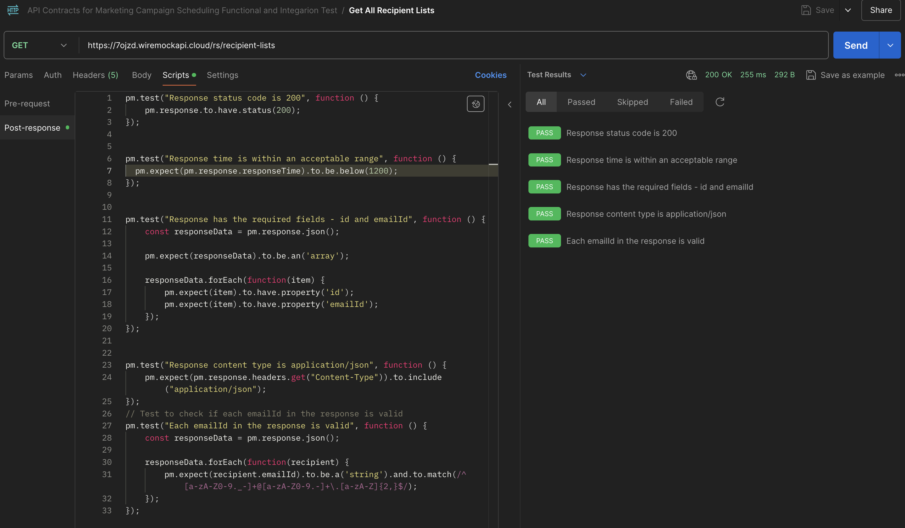
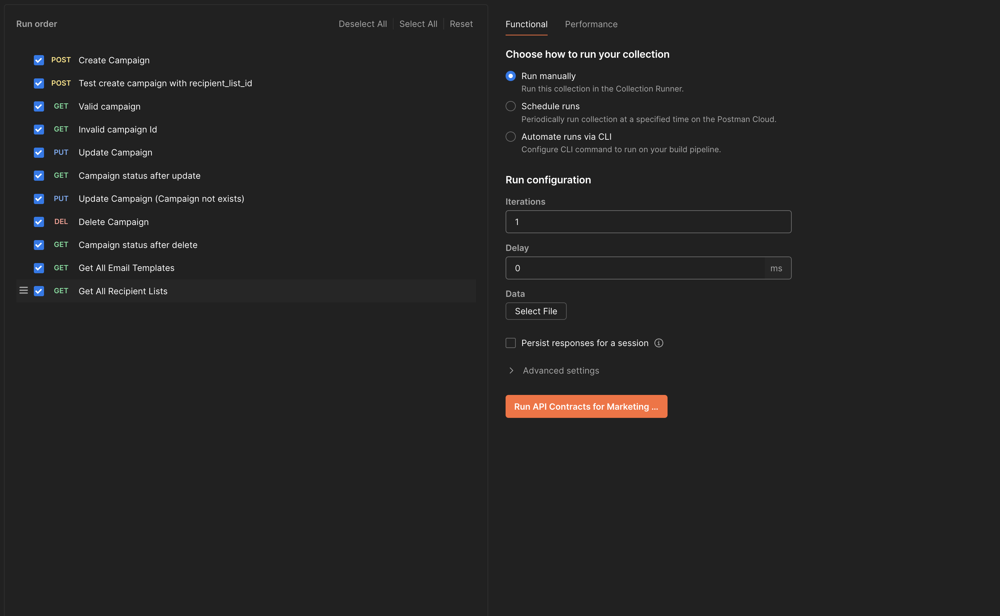
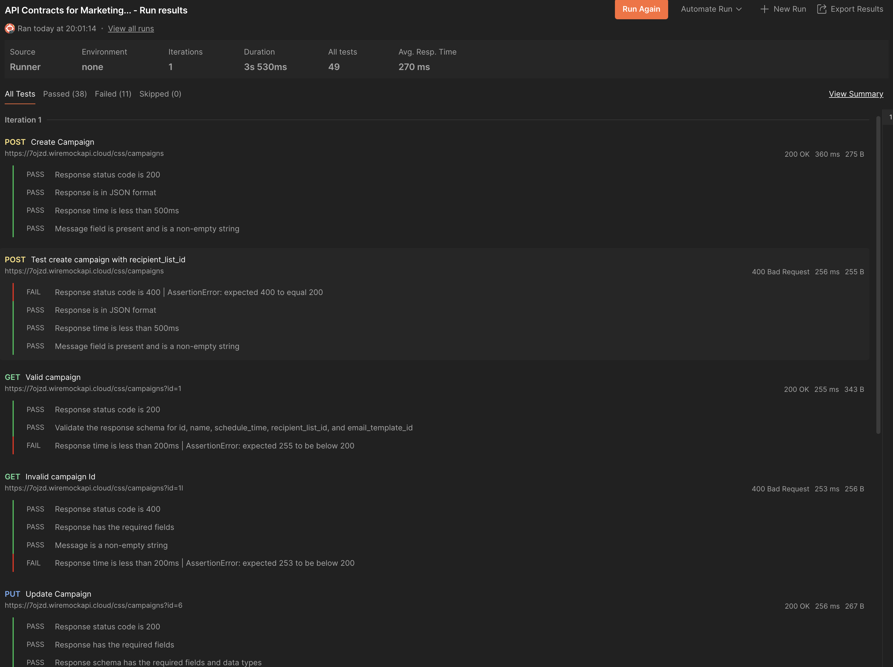

# Marketing Campaign Scheduling Test Plan and automation testing

## Milestone 1, 2, 3


Above mentioned sheet has three 3 worksheet sheets (Functional Test Plan, Campaign Scheduling Integration and UI Automation Test Plan)

## Milestone 4,5


this postman collection consists all the APIs and their test cases, to run the test cases go with the flow mentioned below:

1. Import the collection mentioned above (link: https://learning.postman.com/docs/getting-started/importing-and-exporting/importing-and-exporting-overview/)
2. After import, you will see below APIs in your collection

3. All the test cases are written in Post-response script

4. Now run the collection (link: https://learning.postman.com/docs/collections/running-collections/intro-to-collection-runs/)

5. After successfully run, you can see results like below


Note 1: All the APIs are hosted on wiremock for testing purpose, in case any API is not working, please let me know.
Note 2: For faser writing and to avoid any testing environment setup, I used postman scripts. The same can be written in 
Python or Java. Let me know if that is required.

### API Contacts:
1. Create Campaign
```bash
curl --location 'https://7ojzd.wiremockapi.cloud/css/campaigns' \
--header 'Content-Type: application/json' \
--data '{
    "name": "Test successfull create campaign",
    "schedule_time": 1716777036,
    "recipient_list_id": [1, 2],
    "email_template_id": [1, 2]
}'
```
Response
```
{
    "message": "campaign created successfully"
}
```

2. Get campaign information
```bash
curl --location 'https://7ojzd.wiremockapi.cloud/css/campaigns?id=1'
```
Response
```
{
    "id": 1,
    "name": "Test successfull create campaign",
    "schedule_time": 1716777036,
    "recipient_list_id": [
        1,
        2
    ],
    "email_template_id": [
        1,
        2
    ]
}
```
3. Update campaign
```bash
curl --location --request PUT 'https://7ojzd.wiremockapi.cloud/css/campaigns?id=6' \
--header 'Content-Type: application/json' \
--data '{
    "name": "Test successfull update campaign"
}'
```
Response
```
{
"message": "campaign updated successfully"
}
```
4. Delete Campaign
```bash
curl --location --request DELETE 'https://7ojzd.wiremockapi.cloud/css/campaigns?id=100'
```
Response
```
{
    "message": "campaign deleted successfully"
}
```
5. Get All Email Templates
```bash
curl --location 'https://7ojzd.wiremockapi.cloud/ets/email-templates'
```
Response
```
[
    {
        "id": 1,
        "name": "template 1",
        "content": "Some email content"
    },
    {
        "id": 2,
        "name": "template 2",
        "content": "Some email content"
    }
]
```
6. Get All Recipient Lists
```bash
curl --location 'https://7ojzd.wiremockapi.cloud/rs/recipient-lists'
```
Response
```
[
    {
        "id": 1,
        "emailId": "aliyakumari36@gmail.com"
    },
    {
        "id": 2,
        "emailId": "abc@gmail.com"
    }
]
```