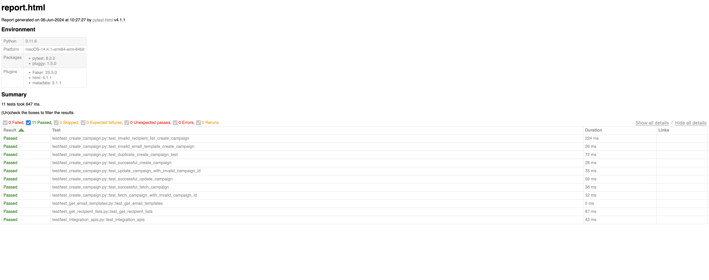

# Marketing Campaign Scheduling Test Plan and automation testing

## Milestone 1, 2, 3


Above mentioned sheet has three 3 worksheet sheets (Functional Test Plan, Campaign Scheduling Integration and UI Automation Test Plan)

## Milestone 4, 5

### Steps to run test suite
1. Ensure you have python 3.9 or greater
2. You should be able to create virtual env in python
3. If above two requirements are satisfied, run below commands
   1. Make shell script executable
     ```
     chmod +x run_tests.sh
      ```
   2. Run the shell script
     ```
     ./run_tests.sh
     ```
4. Now check the report in report.html (sample report attached below)

